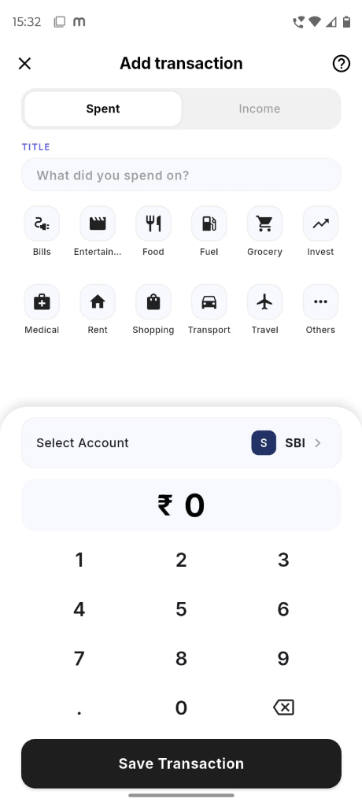
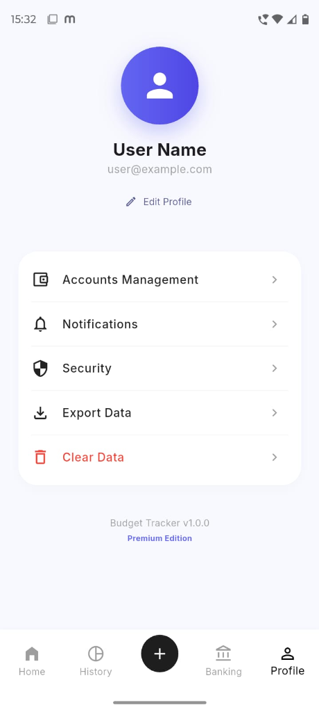

<div align="center">


# ✨ Expense Tracker ✨
### *The Ultimate Personal Finance Companion*

[](https://flutter.dev)
[](https://dart.dev)
[](https://isar.dev)
[](https://riverpod.dev)
[](https://android.com)

---

### 🚀 **Direct Download**
<a href="https://github.com/karthik-cyberexpert/Expense-Tracker/releases/download/v1.0.1/Expense-Tracker.apk">
  
</a>

[**Download Latest APK (v1.0.1)**](https://github.com/karthik-cyberexpert/Expense-Tracker/releases/download/v1.0.1/Expense-Tracker.apk)

</div>

## 🌟 Overview
**Expense Tracker** is a premium, high-performance finance management application built with Flutter. Designed for users who demand both aesthetic excellence and functional depth, it helps you track, manage, and analyze your finances with ease.

---

## 🎨 Professional UI Showcase
<div align="center">
  
</div>

---

## � App Screenshots
<div align="center">
  <table>
    <tr>
      <td></td>
      <td></td>
      <td></td>
      <td></td>
    </tr>
    <tr>
      <td align="center"><b>Dashboard</b></td>
      <td align="center"><b>Smart Entry</b></td>
      <td align="center"><b>Multi-Account</b></td>
      <td align="center"><b>Settings</b></td>
    </tr>
  </table>
</div>

---

## �💎 Key Features

- 🏦 **Banking Mastery**: Seamlessly manage multiple accounts (Savings, Salary, Credit) with custom colors and brand logos.
- 📊 **Dynamic Analytics**: Visualize your spending habits with interactive **fl_chart** reports (Income vs. Spent).
- 🔐 **Biometric Security**: Protect your financial data with enterprise-grade **Fingerprint/FaceID** authentication.
- ⚡ **Lightning Fast**: Powered by **Isar Database**, offering near-instant local data access with zero lag.
- 🧠 **Smart Logic**: Built using **Riverpod** for robust, reactive state management across all screens.
- 🔔 **Intelligent Reminders**: Never miss an entry with local notifications and background synchronization.
- 📸 **Receipt Attachments**: Integrated camera and image picking to keep track of physical receipts.

---

## 🛠️ Technology Stack

- **Framework**: [Flutter](https://flutter.dev)
- **State Management**: [Riverpod 2.0](https://riverpod.dev)
- **Persistence**: [Isar NoSQL](https://isar.dev)
- **Charts**: [FL Chart](https://flchart.dev)
- **Icons**: [Lucide Icons](https://lucide.dev)
- **Fonts**: [Google Fonts (Inter)](https://fonts.google.com)
- **Security**: [Local Auth](https://pub.dev/packages/local_auth)

---

## 🏗️ Getting Started

### Prerequisites
- Flutter SDK (latest stable version)
- Android Studio or VS Code
- A connected device or emulator

### Installation

1. **Clone the repository**
   ```bash
   git clone https://github.com/karthik-cyberexpert/Expense-Tracker.git
   ```

2. **Navigate to the directory**
   ```bash
   cd Expense-Tracker
   ```

3. **Install dependencies**
   ```bash
   flutter pub get
   ```

4. **Run build runner** (for Riverpod/Isar generation)
   ```bash
   flutter pub run build_runner build --delete-conflicting-outputs
   ```

5. **Launch the app**
   ```bash
   flutter run
   ```

---

## 📦 Releases
Check out the [latest releases](https://github.com/karthik-cyberexpert/Expense-Tracker/releases) for the production-ready APK.

---

<div align="center">
  <p>Made with ❤️ by <a href="https://github.com/karthik-cyberexpert">Karthik</a></p>
</div>
